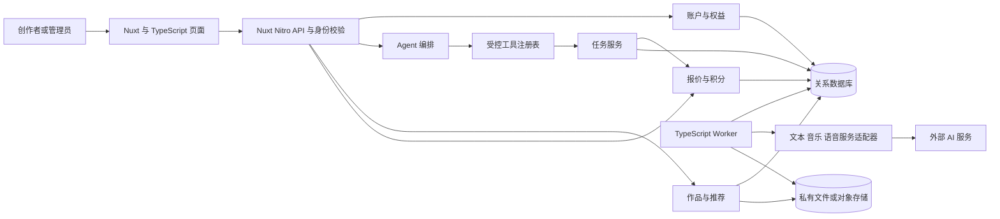
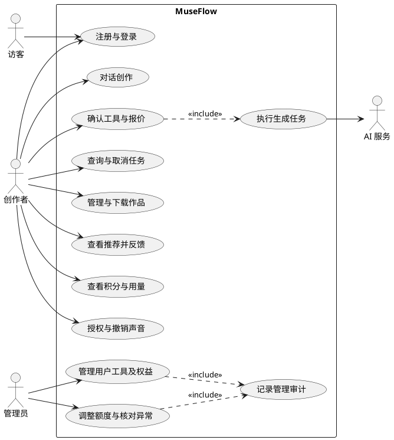

# MuseFlow 系统架构

本文是概要设计草案。团队已确认 3 人、使用 Nuxt + TypeScript，按课题范围及 P0/P1 顺序推进，文本/音乐/TTS 供应商可切换。技术选型和理由统一维护在本文，评审过程留在对应 Issue/PR；当前没有已部署服务。

## 技术选型与待定项

Nuxt + TypeScript 已确认；下表其余方案尚未安装或验证，由 MF-01 认领者组织评审后更新状态。创建协作仓库不依赖所有细节一次性定完，初始化代码骨架前确定所需依赖即可。

| 层 | 状态与方案 | 依据和后续工作 |
| --- | --- | --- |
| Web | **已确认：Nuxt + TypeScript** | 初始化时锁定兼容版本，启用严格类型检查 |
| API | 提案：Nuxt Nitro，使用 `server/api` | 页面与 API 同源；保留业务模块和 REST 契约 |
| Agent | 提案：AI SDK | 模型、流式响应和有界工具循环；理由及验证要求见下文 |
| Worker | 提案：独立 Node.js + TypeScript 进程 | 共享领域规则；耗时生成与 Web 请求分开执行 |
| 数据库 | 候选：PostgreSQL，查询库待定 | 验证事务、唯一约束、任务领取及账本并发 |
| 文件 | 提案：开发期私有文件目录，部署期私有对象存储 | 通过 Storage Adapter 访问；声音样本不能放公开目录 |
| 工具链 | 候选：pnpm workspace；认证、UI、测试库待定 | MF-01 评审必要依赖，MF-04 初始化并验证，提交锁文件及运行要求 |

其余细节随相应 Issue 确定：双积分含义、价格和权益由 MF-07 评审；具体供应商、账号及预算在真实接入前确认；声音衍生作品的撤销/删除政策在 MF-17 明确。部署平台按实际演示需要选择，成员信息及课程材料见[课程要求](COURSE_REQUIREMENTS.md)。这些事项不重新打开已确认的课题范围、P0/P1 或日期策略。

变更选型时直接更新本表及受影响文档，在 Issue/PR 记录日期、理由和评审结论；不要求另写决策文件。候选方案不能写成已实现能力。

## 设计路线与系统边界

采用面向对象分析与设计，提供用例图、领域类图、状态图和时序图。建议由同一 Nuxt 应用承载页面及 Nitro API，业务模块保持清晰职责；Worker 独立进程启动，共享领域规则与数据库。首轮不按团队人数拆成三个微服务。



外部 AI 服务不直接操作用户钱包或应用数据库。模型只输出工具建议和结构化参数；服务端负责身份、授权、额度、任务写入和产物提交。所有来自模型、上传文件及 Provider 的结果都按外部输入验证。

## 用例图

以下为标准 UML 用例图的 PlantUML 源码。仓库保留可编辑图源；汇入课程报告前需渲染，不将未渲染代码块当作最终图件。



确认并不保证执行成功；UC4 内部仍需校验报价有效期、余额和能力可用性。对话可以只做澄清而不调用生成工具，故 UC2 不必然包含收费执行。

## 模块职责与依赖

| 模块 | 负责 | 对外接口与限制 |
| --- | --- | --- |
| Identity | 注册、会话、角色、账户状态、个人工作空间归属 | 提供可信用户上下文；不接受客户端指定资源所有者 |
| Entitlements | 工具可用范围、时长规格、并发上限、方案版本 | 任务提交时检查并快照；不让新方案改变已确认任务的价格 |
| Conversation / Agent | 历史、上下文整理、意图澄清、工具建议、结果解释 | 通过 Tool Registry 操作；不直接写账本或伪造任务状态 |
| Tool Registry | 工具 schema、输入规范化、能力表和授权前置条件 | 只允许明确注册的工具；限制每轮步骤和请求预算 |
| Jobs / Worker | 持久化任务、领取租约、Provider 调用、查询、结果落盘、故障恢复 | 任务为真实执行记录；耗时调用不得持有数据库长事务 |
| Billing | 报价、冻结、结算、释放、管理员额度调整、流水核对 | 金额由服务端计算；每个动作幂等；只修改归属钱包 |
| Assets | 歌词、音频、封面、声音样本的元数据、存储、预览下载与删除 | 私有存储；仅返回授权访问路径；产物保留来源标记 |
| Recommendation | 合法候选集、行为事件、偏好、排序理由、反馈 | 首轮标签算法；不读取其他用户私人作品或声音样本 |
| Admin / Audit | 操作权限、工具/权益/价格配置、异常处理与审计 | 密钥用外部配置引用；后台只显示掩码与配置状态 |

## 核心用例说明

| 用例 | 前置条件 | 主流程 | 异常或结束条件 |
| --- | --- | --- | --- |
| UC2 对话创作 | 已登录、会话归属当前用户 | 输入意图 → 澄清必要参数 → Agent 建议工具与输入 → 生成报价卡 | 无工具可用或无法满足需求时解释限制；不发起虚假任务 |
| UC3/UC4 执行 | 参数已固定、报价未过期、权益/授权满足 | 用户确认 → 原子创建任务并冻结 → Worker 执行 → 校验入库 → 结算 | 余额不足不建任务；未知结果转核对；失败释放 |
| UC6 管理作品 | 当前用户拥有作品 | 查找 → 试听/阅读 → 下载或改名 → 可选择删除 | 非所有者无权访问；删除先撤销访问，再清理存储 |
| UC7 推荐反馈 | 已登录，可没有历史 | 计算候选 → 展示理由 → 试听/收藏/不感兴趣 → 更新偏好 | 关闭个性化后采用通用候选；删除的作品立即排除 |
| UC11 异常核对 | 管理员权限、存在待处理事项 | 查看脱敏请求证据 → 查询 Provider → 确认归档结算或失败释放 → 写审计 | 无证据不能随意改成功/失败；不能绕过账本直接改余额 |

## Agent 设计

采用受限的“观察 → 选择工具 → 确认 → 执行 → 观察结果”循环。首轮每次用户输入最多产生 3 个待执行步骤，每个收费步骤单独确认；模型上下文只带必要会话片段、当前用户选择的作品与可用工具能力。

建议使用 AI SDK 负责模型接入、流式响应和有界工具循环，TypeScript 领域模块负责工具注册、参数与权限校验、报价确认和任务创建。SDK 内的工具动作可以返回提议或 taskId，不应阻塞等待整首音乐生成。待任务结果入库后，再加载会话和工具结果进入下一轮。AI SDK 目前仍是候选，没有安装或运行验证。

当前只有一个创作助手，每个收费步骤由用户确认，长时间等待由业务任务系统承接，因此首轮无需额外引入图编排框架。具体选择如下：

| 方案 | 本项目取舍 |
| --- | --- |
| 供应商 SDK + 自写循环 | 需自行维护消息、流式协议和工具循环；仅在候选 SDK 无法正确支持目标服务时考虑 |
| AI SDK + 持久化业务状态 | 首轮建议；会话、授权、任务及计费恢复仍由项目实现 |
| LangGraph + 持久化 checkpointer | 当跨多阶段暂停恢复、条件循环、并行方案汇总成为明确需求时再评估 |

采用前验证目标模型的工具调用、Nuxt/Vue 流式交互、结果回填及确认后的恢复。若采用 SDK UI 协议，先补充 [API 契约](API_CONTRACT.md)中的消息流及持久化映射。SDK 的 approval 必须绑定服务端保存的用户、输入、报价及有效期，通用重试不能重复收费。未来引入图编排时，需验证 checkpoint 重放不重复创建任务；不能用内存 checkpoint 代替持久化恢复。

无论使用哪种 SDK，都应保存模型建议、参数校验结果、用户确认、tool call ID、task ID、真实结果与异常恢复，作为 Agent 行为证据。不要保存或展示模型私有思维过程。任务/积分状态仍以业务数据库为准，Agent 框架的 checkpoint 不能替代业务事务。

普通澄清和规划调用也有供应商成本：首轮不向用户钱包单独收费，但需服务端频率、并发和每日预算限制，并记录用量。预算耗尽时停止调用并提示。歌词生成作为明确工具动作按报价收费。

## 可切换供应商

此项接入方式已于 2026-09-20 确认。文本、音乐、TTS 分别建立能力接口，不预先绑定商业服务商。工具面向业务输入输出，Provider Adapter 负责供应商的请求格式、认证、流式/同步/异步结果和错误映射。

| 能力接口 | 负责内容 | 必须声明的差异 |
| --- | --- | --- |
| Text Provider | Agent 文本/工具调用、歌词生成、结构化结果；按能力支持流式响应 | 工具调用、结构化输出、流式支持；用于 Agent 的配置须满足相应能力 |
| Music Provider | 音乐任务提交、受理标识、结果查询和产物获取 | 歌词/纯音乐、时长规格、查询、幂等、取消；不支持的动作明确返回不可用 |
| Speech Provider | 文本、音色、语言等输入到语音产物；必要时查询异步结果 | 语言、音色、格式、同步或异步模式，以及克隆音色支持范围 |

管理员通过配置选择已实现的 adapter，并设置服务地址（如需要）、模型、凭据引用和能力参数；各类可使用不同供应商。相同协议的服务可以复用适配器，但不承诺任意服务仅修改 base URL 即可使用。模型与业务代码不接收用户随意指定的服务地址或密钥。

切换默认配置只影响新的模型请求和新报价。已签发报价固定原供应商配置版本，确认后任务复制该快照；在途任务、后续查询/取消和已有声音档案始终路由到其原供应商。原配置不可用时要求重新报价确认或进入异常处理，不能自动改用另一服务重复生成。正在进行的文本流保留原请求连接，下一轮再读取新默认配置。

本阶段只需接口、配置、必要的适配器与 Mock；不扩展为自动负载均衡、跨供应商故障切换或插件市场。详细契约见 [API 文档](API_CONTRACT.md#provider-内部契约)。

## 推荐闭环

1. 候选集由允许使用的素材目录、当前用户自己的可用作品及人工维护的灵感条目组成；素材目录必须附来源与使用范围。
2. 输入为用户主动选定的风格标签，以及创建成功、试听、收藏、不感兴趣等去重事件；重复播放需要频次上限，避免刷偏好。
3. 首轮可用可解释评分：标签相似度 × 权重，加收藏/创作偏好和适度新鲜度，减不感兴趣惩罚。权重在 M1 固定为版本化配置，测试使用固定候选和事件验证变化。
4. 每次推荐保存规则版本、候选来源和理由标签。推荐服务返回“近期偏好轻音乐”等可核验理由，不生成“其他用户都喜欢”之类无数据支持的话术。
5. 用户可关闭个性化或重置偏好；重置不删除作品，但清除用于推荐的个人事件和偏好快照。被删除/禁用的资源不进入候选。

该方案满足行为影响后续推荐的产品闭环，尚不包含训练模型、协同过滤或向量数据库。

## 部署和恢复提案

首轮本地运行 Nuxt 应用（页面与 Nitro API）、独立 Worker、关系数据库及私有存储。建议 Nuxt 采用 Node.js 服务端部署，Web 与 API 保持同源，简化 Cookie、跨域与访问控制；外部 Provider 凭据仅由后端读取。远程环境使用 HTTPS。持续执行的 Worker 不依赖请求结束后的进程存活假设。

任务以数据库记录作为事实来源。初期 Worker 从持久化任务表领取任务，领取时加短事务锁和租约，执行时释放锁。租约过期后先判断 Provider 是否已接受请求，再决定查询或安全重试；不能把所有中断直接重排。只有观测到吞吐或运维需求后才讨论独立消息队列。

数据库事务不能覆盖外部网络与对象存储。任务使用稳定请求标识、暂存对象、结果校验和幂等提交补足边界；无引用的暂存文件由清理任务回收。详情见[创作与积分流程](WORKFLOWS.md)。

任务执行中重启后的状态与账本恢复属于核心正确性验证。每日备份、保存周期和备份恢复演练作为实际部署时的可选工作，不增加为课题完成门槛；没有实测前不声称可用性或容灾等级。

## 建议代码布局

以下目录仅为未来骨架设计，目前尚未创建。

```text
apps/web/                 Nuxt 应用与配置
apps/web/app/             工作区、管理页面、组件和 composables
apps/web/server/api/      Nitro HTTP 入口，保留 /api/v1 契约
apps/web/server/modules/  认证、业务服务和 Agent 编排
apps/worker/              耗时生成、Provider 查询、产物归档
packages/contracts/      请求/响应 schema、类型和稳定错误码
packages/domain/         任务、账本、权限及推荐规则
packages/providers/      文本、音乐、TTS 等适配器和 Mock
packages/database/       迁移、数据访问与种子数据
docs/                    需求、设计、Issue 及验收资料
```

上述 Nuxt 目录按当前官方文档组织，版本锁定时再核对。前端只依赖可公开的 contracts；不得从数据库或 Provider 包导入密钥配置。共享 TypeScript 类型不能替代运行时验证，HTTP 和 Provider 响应均须校验。Nuxt 页面路由中间件只处理页面导航，API 必须在 Nitro 服务端独立鉴权。

## 选型参考

原选型分析参考了 [Nuxt 服务端目录](https://nuxt.com/docs/4.x/directory-structure/server)、[AI SDK Nuxt 指南](https://ai-sdk.dev/docs/getting-started/nuxt)、[ToolLoopAgent](https://ai-sdk.dev/docs/reference/ai-sdk-core/tool-loop-agent)、[PostgreSQL 行锁](https://www.postgresql.org/docs/17/explicit-locking.html)及 [LangGraph 持久化](https://docs.langchain.com/oss/javascript/langgraph/persistence)文档。初始化时按选定版本复核；这些资料不能代替本项目的兼容性和恢复测试。
