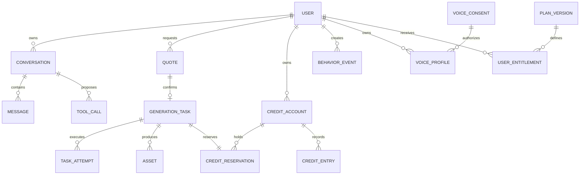
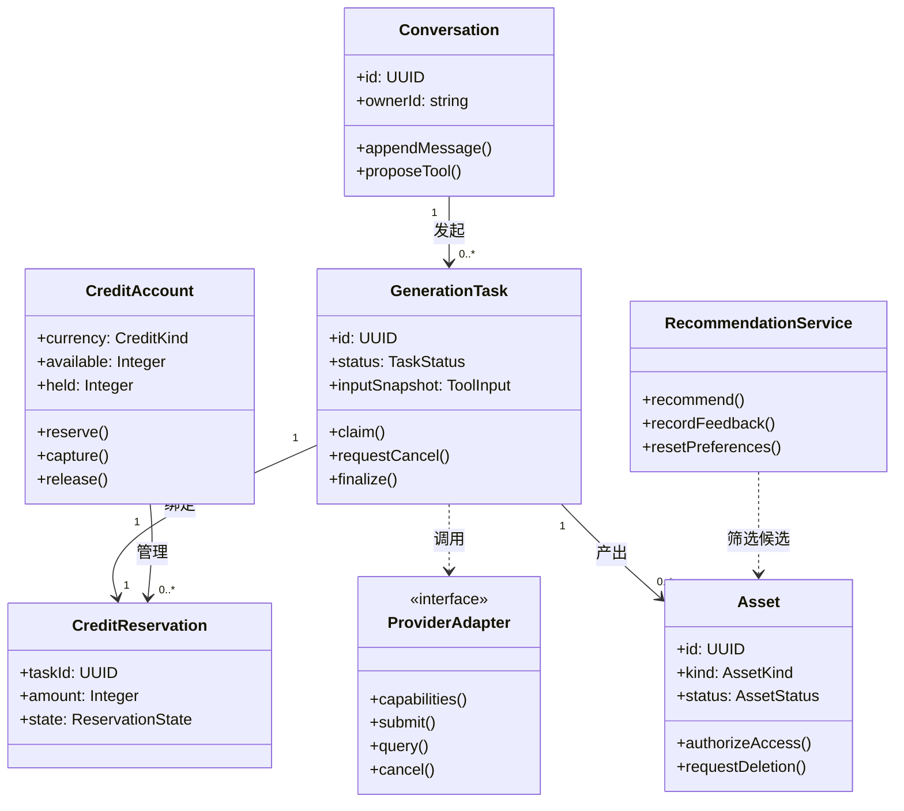

# 数据模型与字典

状态：逻辑模型草案。数据库与查询库已于 2026-09-20 确认为 PostgreSQL + Drizzle；具体版本、驱动和 DDL 尚未核验。迁移按[数据库与迁移约定](ARCHITECTURE.md#数据库与迁移约定)管理。本文提供概念关系、领域类、核心字段和物理约束建议，不能称为已经建库或完成数据库验收。

## 概念关系

ER 图展示核心关系，不穷举认证、配置和审计表。每个业务资源具有明确 `owner_id`；关联查询同时校验外键和所有者一致性，不能只因两个 UUID 存在就允许跨用户引用。

## 领域类图

这些是领域职责，不要求代码机械地采用类继承；TypeScript 接口与函数也可实现相同约束。

## 通用约定

- 业务资源主键使用应用生成的 UUID v4，客户端视为不透明字符串；认证表主键遵循 Better Auth schema，用户外键匹配其实际类型，不假设为 UUID。时间字段使用 `timestamptz`，API 输出 UTC ISO 8601（`Z` 后缀），页面本地化显示。
- 积分使用 PostgreSQL `bigint` 和精确整数运算，余额及冻结额非负；流水增减可以为负；API 使用十进制整数字符串，避免 JSON 数值精度丢失，并校验数据库可表示范围。
- 可变业务行有 `version` 用于条件更新；创建、更新和删除时间语义明确。
- 任务输入、报价、权益、模型及规则版本保存快照。JSON 仅用于经过 schema 验证的变化字段，不替代所有者、状态和金额等可约束列。
- 对话、样本和音频默认私有；演示数据必须有 `source_mode=mock|real|manual`，导入文件另记原始来源。

## 核心数据字典

各表默认含 `id`、`created_at`；需要更新的表另含 `updated_at`。以下字段是实现最小契约，非完整 SQL。

| 表 | 主要字段 | 关键约束与用途 |
| --- | --- | --- |
| `users` | Better Auth 用户字段及业务字段 `role`、`status`、`personalization_enabled` | 邮箱唯一；角色 creator/admin，由服务端控制；实际字段及映射按锁定版本 schema 确定 |
| 认证关联表 | Better Auth 的 account、session、verification 等 schema | 密码凭据与数据库会话交由 Better Auth 管理；不预设 users.password_hash 或 sessions.token_hash；实际表名、字段和迁移随选定 adapter 核验；退出撤销当前会话，停用撤销全部会话；凭据和会话令牌不得进入业务响应或日志 |
| `conversations` | `owner_id`、`title`、`status` | 会话隔离；删除会话不自动删除账本或作品 |
| `messages` | `conversation_id`、`owner_id`、`role`、`parts`、`metadata`、`schema_version`、`status`、`client_message_id?`、`request_id` | 持久化 UIMessage；用户输入按 owner/conversation/client_message_id 唯一去重；状态 streaming/completed/interrupted/failed；工具 part 关联业务工具记录和真实 taskId，不存私有思维过程；见 API 消息流映射 |
| `tool_calls` | `owner_id`、`conversation_id`、`tool_name`、`input_snapshot`、`input_hash`、`status`、`confirmed_at?`、`version` | 保存提议、拒绝、确认、完成的证据；不保存模型私有思维过程 |
| `provider_configs` | `provider_key`、`version`、`kind`、`adapter_id`、`model_id`、`base_url?`、`credential_ref`、`capabilities`、`parameter_mapping`、`enabled` | `(provider_key, version)` 唯一；kind 为 text/music/tts；发布版本不可覆盖，启停独立审计；凭据仅存服务端配置引用 |
| `provider_defaults` | `kind`、`provider_config_id`、`version` | kind 唯一；切换时验证能力并审计，仅用于新请求和报价的选择 |
| `tool_configs` | `tool_name`、`version`、`enabled`、`input_schema_version`、`capabilities`、`provider_kind`、`provider_ref?` | 版本唯一；provider_ref 可指定某个配置版本，无指定时读取对应 kind 的默认配置；报价保存最终选中的配置 |
| `price_rules` | `tool_name`、`version`、`currency`、`specification`、`amount`、`active_from` | 规则版本不可覆盖；同一规格在有效时间只能选中一条 |
| `quotes` | `owner_id`、`tool_call_id`、`input_hash`、`input_snapshot`、`provider_snapshot`、`capability_snapshot`、`price_version`、`currency`、`amount`、`expires_at` | 用户、参数及供应商配置版本绑定；一个报价最多对应一个任务；任务复制该快照 |
| `generation_tasks` | `owner_id`、`conversation_id`、`tool_call_id`、`quote_id`、`tool_name`、`status`、`source_mode`、`input_snapshot`、`provider_snapshot`、`entitlement_snapshot`、`retry_of_task_id?`、`error_code?`、`lease_until?`、`lease_token?`、`version` | `quote_id` 唯一；状态见创作与积分流程；任务不在 Provider 提交前凭空成功 |
| `task_attempts` | `task_id`、`attempt_no`、`dispatch_phase`、`provider_request_key`、`provider_request_id?`、`provider_status`、`started_at`、`finished_at?` | `(task_id, attempt_no)` 唯一；保存可安全重试或只能核对的依据 |
| `task_events` | `task_id`、`event_key`、`from_status`、`to_status`、`actor`、`evidence_ref?` | 事件 key 唯一；可审计状态历史；证据不含密钥 |
| `assets` | `owner_id`、`task_id?`、`kind`、`title`、`storage_key?`、`text_content?`、`mime_type?`、`bytes?`、`duration_ms?`、`checksum?`、`tags`、`source_mode`、`parent_asset_id?`、`cover_asset_id?`、`status`、`deleted_at?` | kind 为 lyrics/audio/cover/voice_sample；文本与文件按类型验证；封面和父作品必须属于同一用户或已授权目录 |
| `credit_accounts` | `owner_id`、`currency`、`available`、`held`、`version` | `(owner_id, currency)` 唯一；available/held ≥ 0；两种 currency 取值固定 |
| `credit_reservations` | `task_id`、`account_id`、`amount`、`state`、`finalized_at?` | `task_id` 唯一；amount > 0；只允许 held→captured 或 held→released |
| `credit_entries` | `account_id`、`task_id?`、`reservation_id?`、`kind`、`available_delta`、`held_delta`、`operation_key`、`operator_id?`、`reason?` | operation_key 唯一；append-only；账户余额可由流水核对重建 |
| `plan_versions` | `plan_code`、`version`、`tool_allowlist`、`max_concurrency`、`allowed_specs` | 无真实支付依赖；方案变更新增版本 |
| `user_entitlements` | `owner_id`、`plan_version_id`、`starts_at`、`ends_at?`、`status` | 同一用户同一时刻仅一个有效方案；提交时用当前方案并做快照 |
| `behavior_events` | `owner_id`、`event_key`、`event_type`、`target_ref`、`tags_snapshot`、`occurred_at` | key 去重；服务端验证事件关联用户可访问的资源；有限频次 |
| `recommendation_items` | `kind`、`title`、`tags`、`asset_id?`、`inspiration_text?`、`source`、`usage_scope`、`status` | 允许公开使用的素材/灵感目录；不将用户私人音频自动复制进目录 |
| `preference_profiles` | `owner_id`、`rule_version`、`tag_weights`、`reset_at?` | owner 唯一；可重建和清空，不能作为不可删除的永久画像 |
| `recommendation_runs` | `owner_id`、`rule_version`、`candidate_refs`、`reason_tags` | 保存排序证据；不保存其他用户私有内容 |
| `asset_rights_declarations` | `owner_id`、`asset_id`、`scope`、`declaration_version`、`confirmed_at`、`revoked_at?` | P1；翻唱源音频的使用声明，与目标音色授权分别校验 |
| `voice_consents` | `owner_id`、`sample_asset_id`、`scope`、`declaration_version`、`confirmed_at`、`revoked_at?` | P1；授权不得自动推断；记录声明不等于平台已核实全部权属 |
| `voice_profiles` | `owner_id`、`consent_id`、`source_task_id`、`provider_config_id`、`provider_voice_ref?`、`status`、`deletion_requested_at?` | P1；pending/active/revoked/deletion_pending/deleted；仅 active 可调用；音色绑定原供应商，不随默认切换迁移 |
| `idempotency_records` | `owner_id`、`operation`、`key`、`request_hash`、`resource_id`、`response_snapshot` | `(owner_id, operation, key)` 唯一；相同 key 不同请求冲突；任务与账务操作映射长期保留 |
| `audit_logs` | `actor_id`、`action`、`target_type`、`target_id`、`reason`、`change_summary`、`request_id` | 追加记录；后台操作留痕；快照脱敏 |

## 物理设计提案

`provider_snapshot` 保存配置 ID/版本、adapter、模型、规格映射及恢复原配置所需的引用，不复制密钥。报价、任务或声音档案仍引用的配置版本不能直接删除；凭据通过引用读取和轮换。默认切换不改历史快照，也不把原供应商的请求 ID 发送给新的供应商。

已确认 PostgreSQL 使用 UUID 承载业务资源 ID、`timestamptz` 承载时间、`bigint` 承载积分；认证表及用户外键按 Better Auth schema 映射。状态和验证后的快照建议分别使用有限长度字符串及 `jsonb`，具体字段约束随迁移评审固定。金额运算和账务修改在数据库事务内完成。

| 访问模式 | 索引或约束建议 |
| --- | --- |
| 作品库按用户与日期分页 | `assets(owner_id, created_at, id)`；为可用作品建立状态过滤索引 |
| 会话消息顺序读取 | `messages(conversation_id, created_at, id)`，查询必须附归属校验 |
| 任务服务筛选待执行任务 | `generation_tasks(status, created_at, id)`，若采用租约，再增加 `lease_until` 索引用于恢复扫描 |
| 钱包与流水 | 唯一 `(owner_id, currency)`，流水 `(account_id, created_at, id)` 和 `operation_key` 唯一 |
| 幂等与重复结果 | quoteId、task reservation、Provider 事件 key 和产物输出槽位均唯一；一个 task 的同一槽位只能归档一次 |
| 标签与检索 | 首轮定义标题/歌词的中文子串检索语义；数据量增大后评估索引，不默认英文全文检索满足中文要求 |

任务还需保存产物的 `output_slot` 并在有 `task_id` 时建立唯一 `(task_id, output_slot)`；这比依赖文件名防重更可靠。所有外键的删除策略需在 DDL 中显式选择，不能级联删除账本或审计记录。

物理设计完成门槛是：选定数据库与版本，补迁移 SQL、字段长度/空值/枚举约束、外键与索引、初始化数据，并对建库、升级及并发事务实测。当前这些可执行产物尚不存在。

`lease_until` 与 `lease_token` 是采用租约调度时的候选字段，由 MF-08 明确需求后通过迁移引入，不作为 MF-05 必须提前实现的字段。任务持久化、版本控制、幂等与中断恢复要求不因暂不设独立 Worker 而取消。

## 生命周期与删除

- 删除作品：先将资源设为不可访问并排除推荐，再清理对象和文本内容；保留不含作品内容的任务与账务证据。失败时维持 `deletion_pending` 并可重试。
- 关闭个性化：停止生成个人偏好和收集推荐用途事件，使用通用候选；重置偏好另行清除已有推荐事件与缓存。业务必需的任务/账务记录独立存在。
- 撤销声音授权：执行[创作与积分流程](WORKFLOWS.md)中的队列取消、外部核对和删除流程。
- 存储文件、业务元数据与备份有不同保留期；实际天数、备份清理和账户注销流程在部署前决定并写入用户说明。不承诺尚未实现的即时跨备份删除。
- 下载通过每次请求鉴权的 API 代理（首轮建议）。若改为短期签名 URL，需要明确有效期和删除后的残留访问窗口，不能继续宣称可立即撤销已签发 URL。
