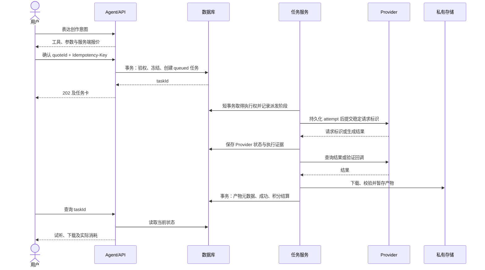
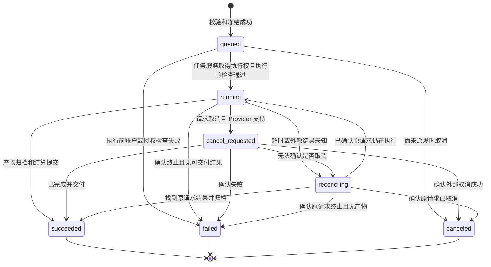

# 创作与积分流程

当前采用根目录 Nuxt 应用，任务服务由 MF-08 在 `server/` 内实现，不预设独立 Worker。以下任务持久化、幂等与恢复要求仍须满足；具体调度、回调、查询及恢复触发方式依据 Provider 能力确定，租约仅在采用相应执行机制时适用。

状态：流程细节提案；供应商可切换方向已于 2026-09-20 确认。关联需求：FR-02、FR-03、FR-04、FR-07、FR-09、FR-10、FR-11。本文定义 Agent、任务、Provider、产物和积分之间的详细流程，是实现和异常验收的共同依据。

## 设计不变量

1. 每次收费工具调用必须关联当前用户、规范化输入、不可变报价、确认记录和幂等键。
2. 未成功冻结所需积分，不创建可执行任务；创建任务与冻结在同一数据库事务中完成。
3. 同一任务只能有一次最终结算：要么扣除冻结额度，要么释放；不能两者同时发生。
4. 任务成功意味着产物已归档并可访问，或克隆声音档案已可引用。模型说“完成”或 Provider 给出临时 URL 都不足以认定成功。
5. 不明确的外部结果进入 `reconciling`，不能先退款再盲目重发，避免用户和平台账实不符。
6. 任务状态、产物元数据及积分最终动作应在同一数据库事务中提交；外部文件先暂存，最终事务失败时允许幂等重放或回收孤立文件。
7. 已确认任务保留工具、模型、输入、价格和权益版本快照，不随之后的配置变更改价。账户停用、声音授权撤销等安全状态须在提交和实际执行前重新检查。
8. 供应商在报价时选定并固定配置版本，确认任务时复制快照。切换默认只影响新请求/报价，旧报价和在途任务仍使用原配置；原配置被禁用时要求重新报价或核对，不能隐式换供应商。查询、取消、恢复也必须使用原供应商，不自动跨供应商重发。

## 主流程

音频拉取只允许受信任 Provider 返回的受控地址，检查重定向、目标地址、内容类型、文件大小和媒体有效性；不让用户或模型传入任意服务器下载地址。输出存储键由系统生成，不使用用户提供的文件路径。

## Agent 步骤

1. 读取用户意图与必要上下文，决定回答、澄清或提议工具。普通回复不产生生成任务。
2. 对工具名、输入 schema、资源归属、模型能力、权益和声音授权做服务端校验。模型不能决定 `ownerId`、积分数值、Provider 密钥或账本状态。
3. 固化输入摘要与报价，展示给用户。用户修改参数后生成新报价，不沿用旧确认。
4. 收到明确确认后提交任务。界面双击、刷新后重送均复用同一幂等键。一个报价最多绑定一个任务，即使客户端改用新幂等键也不能重复执行该报价。
5. 将真实任务和结果写为工具消息。生成音乐使用用户选定的歌词版本；修改歌词之后不自动重新生成或再次扣费。
6. 用户请求多步创作时，下一步依赖已归档产物，并再次确认报价。每轮最多 3 个提议步骤；不会将模型自行循环解释为持续消费授权。

## 任务状态

终态不可被重复或乱序回调覆盖。`queued` 取消与任务服务取得执行权使用同一行锁/版本条件互斥。运行中取消不保证成功；Provider 不支持取消时返回 `CANCEL_NOT_SUPPORTED`，原任务继续。对结果未知的任务，界面显示“正在核对”，不显示可再次付费重试按钮。

只有 `failed` 或 `canceled` 的任务可以由用户重新报价并创建新任务，保存 `retryOfTaskId`。新任务是新的收费尝试，必须重新确认；成功作品的变体生成也创建新任务。

## 积分状态与计算

每种积分有独立钱包：`available` 是可用余额，`held` 是冻结额，二者均为非负整数。服务端采用精确整数运算，API 使用十进制字符串。报价快照记为 `q > 0`；无需收费的规划调用不走零额冻结。

| 事件 | 前提 | 可用余额变化 | 冻结额变化 | 流水与状态 |
| --- | --- | --- | --- | --- |
| 发放/调整 | 管理员授权，调整后不透支且不得动用冻结额 | `+g` 或 `-g` | `0` | `grant` / `adjustment`，带原因 |
| 创建任务 | 可用余额 ≥ q，报价及并发校验通过 | `-q` | `+q` | reservation=`held`，`reserve` |
| 成功交付 | reservation=`held` | `0` | `-q` | reservation=`captured`，`capture` |
| 明确失败/取消 | reservation=`held` | `+q` | `-q` | reservation=`released`，`release` |
| 结果未知 | reservation=`held` | `0` | `0` | 保持冻结，记录核对事件 |

结算使用提交时快照金额，不按新的价格重算。首轮采用固定规格整笔结算：声明的输出全部归档后成功；仅部分输出、损坏文件或下载暂时失败先恢复归档，不能交付不完整结果并全额收费。无法交付时在确定失败后释放。平台的供应商实际成本单独记录，不冒充用户积分数值。

账本保留 append-only 流水，使用唯一业务操作键去重。最终动作在锁定 reservation 后从 `held` 条件更新为 `captured` 或 `released`，同一任务不得分别插入两种最终动作。管理员不能直接覆盖历史余额或删除流水；纠错通过新调整记录完成。

## 并发和崩溃恢复

| 情形 | 必须处理的行为 |
| --- | --- |
| 两次同时确认或余额被另一任务占用 | 以用户级额度锁/条件更新与钱包锁串行检查权益和余额；同一幂等请求返回已有任务，余额不足的不同请求不创建任务 |
| 任务写入后 API 响应丢失 | 客户端用原 key 重送，返回原 taskId；不重新冻结 |
| 任务服务取得执行权后崩溃，尚未调用 Provider | 通过持久化 attempt 与派发阶段判断；只有证明未派发或 Provider 支持相同 key 去重时才安全提交 |
| Provider 已接受，但本地没保存其 ID | 使用稳定请求 key 查询；不能查询也不能幂等提交时进入核对并等待人工证据，不自动调用第二次 |
| Provider 成功，归档失败 | 保留远端请求标识及已有暂存文件，只重试拉取/归档；不重新生成；下载链接失效时查询原请求获取新链接 |
| 文件已写入，数据库提交失败 | 用 taskId 与输出槽位构造稳定存储键，重试归档事务；清理超过保留期且无引用的暂存对象 |
| 重复/乱序回调 | 验签、时间窗和事件去重；校验状态转换；冲突结果进入审计核对，不反转已提交终态 |
| 采用租约时，租约过期但旧执行仍在运行 | 使用递增租约令牌和任务版本拒绝旧执行提交；外部调用还需 Provider 幂等保障，租约本身不保证供应商只执行一次 |

默认建议：网络查询/归档采用有界退避重试，单阶段最多 3 次；生成提交不得使用通用网络重试策略。任务预期时长和查询频率由能力配置给出，不把 HTTP 超时等同于生成失败。未知任务超过配置阈值后告警管理员，冻结不会仅因时间到期自动释放；阈值和人工处理时限在服务选型后确认。

## 声音授权撤销与删除

`voice.clone` 和使用克隆音色的 `speech.synthesize`、`music.cover` 在提交及执行前校验授权状态和样本归属。撤销立即阻止新调用，并扫描排队任务取消释放；运行中的任务请求取消或进入核对。若外部无法取消，返回结果不得继续公开或供复用，应清理并按本项目“不可交付则释放”规则处理，供应商成本由平台单独记录。

用户删除声音档案时先禁用本地引用和访问，再请求 Provider 删除并清理样本。外部删除未确认时保留 `deletion_pending`，界面不能说已完全删除。已有衍生作品标记来源失效并按授权范围决定禁用/删除；这项策略必须在开放 P1 前明确。此处是产品权限设计，不构成对任何素材法律权属的认定。

## 完成证据

一次真实创作至少保存脱敏的 `conversationId`、`toolCallId`、`taskId`、Provider 标识/请求 ID、状态事件、产物元数据和积分流水关联。日志不保存密钥、完整私人音频或未必要的文本。Mock 保存 `sourceMode=mock`，界面与验收报告都显式标记，不能混入真实服务成功率。
